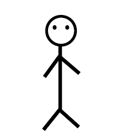

# Lab Exercise
Using the text-edit of your choice (e.g., Atom), create a new file called `PROFILE.md`.

In this exercise, you will create a mini profile of yourself.

In your `PROFILE.md` document, format a title as header with your name as H1, University of Washington as H2, and your class standing as H3

Next, you will insert a photo of yourself using **relative path**.

Then, write a little description about yourself with at least 2 different format stylings like **bold**, or *italicized*.

Next, rank your favorite foods in an **unordered** list.

Lastly, put your favorite quote in a block quote, and provide a link to a website that provides additional information about the quote.

# SHINICHIRO AOYAGI

## University of Washington

### Junior

This is a description about **ME**. This is harder than *I* thought.

* food 1
* food 2
* food 3

[`"If I don't have to do it, I won't. If I do have to do it, make it quick."`](http://www.kyotoanimation.co.jp/kotenbu/)
